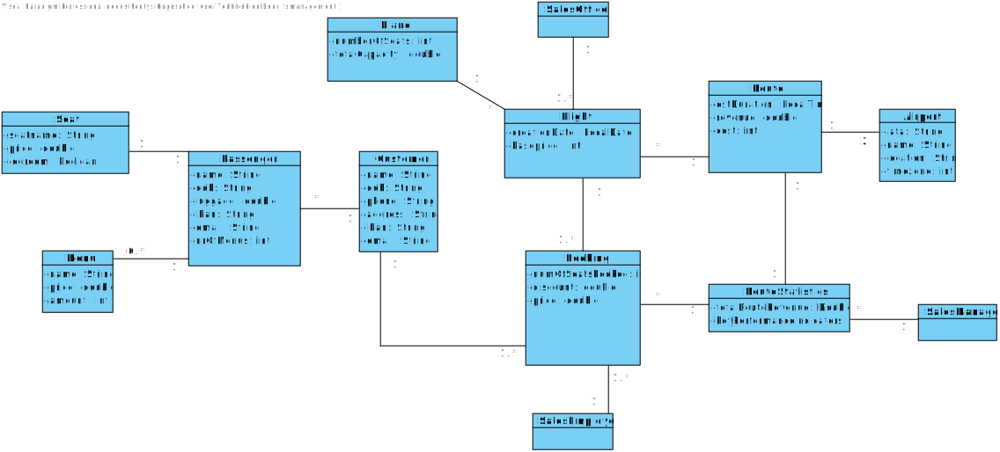

# Links
*User stories are created to descirbe the functionality of the flight system from the perspective of the user:*
<u>[User Stories](UserStories/User-Stories.md)</u> 
*The data dictionary is used to describe all the data elements and attributes used within our system:*
<u>[Data Dictionary](DataDictionary/data_dictionary.md)</u> 
*Use case descriptions are written to show the functionality of the flight system with the use of examples from the users:*
<u>[Use Case Descriptions](UseCaseDescriptions/use-case-descriptions.md)</u> 
*Test scenarios are further defined use cases using real data to test and describe features of the flight system:*
<u>[Test Scenarios](TestScenarios/TestScenarios.md)</u> 

# Analysis

This directory is for all the analysis artefacts.  

# Domain model
*By creating a domain model, it becomes easier to identify and describe the business processes and requirements that need to be supported by the flight system.*

# Use Case Diagram
*A use case diagram is a diagram that represents the interactions between actors and the flight system, and the specific tasks or functions the system performs in response to those interactions.*

# Activity Diagram
*An activity diagram is a diagram that represents the flow of activities or actions within the flight system. It shows the sequence of activities, decision points, branching paths, and the order in which tasks are performed.*
