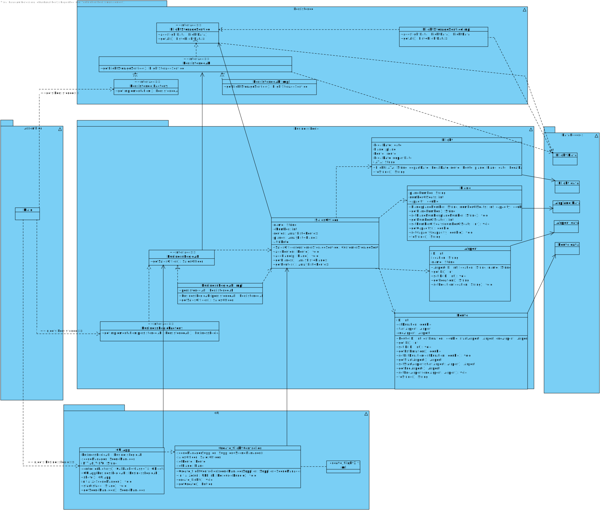
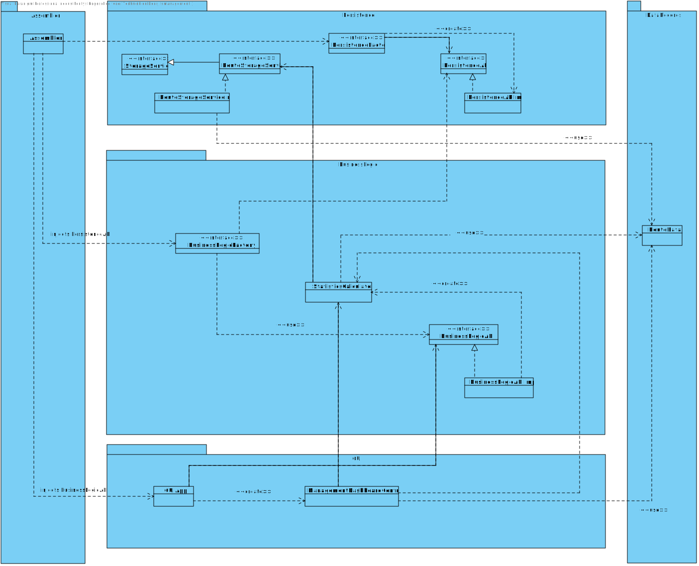
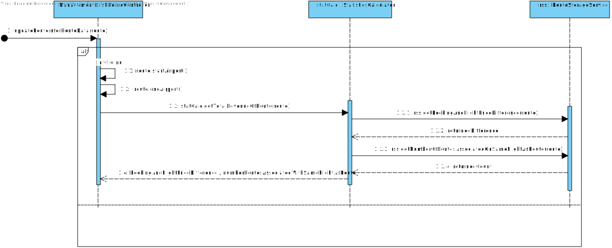

# Design

This directory is for all the design artefacts.  

### Class Diagram
*The class diagram is a type of UML diagram that represents the structure of a system by showing the classes, interfaces, and relationships between them, it is used to show our object oriented-programming that includes Java inheritance.*

#### Airline Information System class diagram

#### Management Dashboard class diagram

### Sequence Diagram
*Describes the interactions between objects for one use case.* 

#### Management Dashboard sequence diagram

### Relational Model Create Flight
*The relation model is a way of showing our database using tables, containing primary keys and foreign keys. This creates a picture of the layout of the flight system's database.*

### Relational Model Create Booking

### Sequence Diagram

